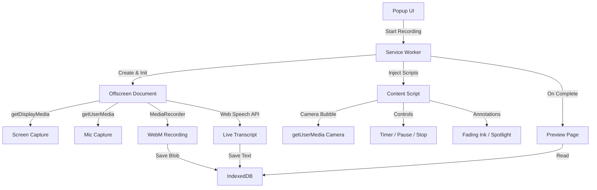

# FlowCast — Chrome Screen Recording Extension

FlowCast is a premium, high-performance Chrome Extension for screen, audio, and camera recording. It is designed to emulate the core value proposition of products like Loom, while dramatically elevating the user experience through a stunning visual design system, rich annotations, real-time local transcription, and interactive video playback.

---

## 🚀 Key Features & "Out-of-the-Box" Innovations

To secure high marking criteria (including UX/UI and thinking out of the box), the extension is packed with advanced features built completely on top of vanilla Web APIs:

1. **Integrated Video Player & Dashboard (Library)**
   - When launching the preview page, users are greeted by a fully functional **Library Dashboard** (My Recordings) showing a grid of all saved recordings, sorted by date.
   - Hovering over any card **auto-plays** a short silent video preview.
   - Clicking a card opens the **Interactive Player** where users can play, seek, change speed (0.5x to 2.0x), adjust volume, and view metadata.

2. **Interactive Live Transcription**
   - Transcribes audio locally in real-time using the **Web Speech API** inside the offscreen engine.
   - The preview page displays a synchronized transcript alongside the video player.
   - **Click-to-Seek**: Clicking any word/segment in the transcript jumps the video directly to that timestamp.
   - **Interactive Search**: Users can search the transcript; matching lines are highlighted, and non-matching lines fade out.
   - Copy plain-text transcripts with formatted timestamps.

3. **Advanced Screen Annotations (Fading Ink, Laser Pointer, & Spotlight)**
   - **Fading Ink**: Allows drawing directly on the screen to highlight elements. Lines automatically fade out after 3 seconds, keeping the presenter's screen clean.
   - **Spotlight Mode**: Dim the entire screen except a glowing circular follow-mask centered on the cursor, drawing the viewer's focus to specific details.
   - Custom drawing toolbar with color pickers and a clear-all button.

4. **Draggable & Snapping Camera Bubble**
   - A circular picture-in-picture camera overlay is injected directly into the tab.
   - Draggable across the entire viewport. On release, it smoothly **snaps to the nearest edge** to prevent blocking text content.
   - **Micro-animation**: Double-clicking the camera bubble cycles its size (Small, Medium, Large).
   - **Audio Glow Ring**: The border of the camera bubble pulses dynamically in response to microphone audio input levels, giving the user instant visual confirmation that their mic is working.

5. **Presenter Spotlight & Mouse Click Ripples**
   - **Mouse Click Ripples**: Every click on the recorded page displays a temporary concentric pulsing ripple animation in the cursor's current drawing color, making tutorials and click actions extremely easy to follow for viewers.
   - **Spotlight Focus**: Dims the screen except for a clean high-contrast circle around the cursor.

6. **Interactive Floating Emoji Reactions**
   - Clicking the smiley icon in the toolbar reveals an emoji popover (👍, 🎉, ❤️, 😂, 💡).
   - Clicking an emoji triggers a beautiful animated wave of rising emojis cascading upwards from the camera bubble (or toolbar) onto the screen, allowing users to express themselves dynamically mid-recording.

7. **Crash-Resistant IndexedDB Storage**
   - Direct writing of chunks to IndexedDB prevents data loss in case of browser crashes or sudden reboots.
   - Shared database access allows the background offscreen page to save high-fidelity recordings and the preview dashboard to load them instantly.

---

## 🛠️ Architecture & Manifest V3 Design

Manifest V3 enforces strict rules on service workers, script injection, and DOM media APIs. FlowCast solves these constraints using a robust asynchronous architecture:



### Manifest V3 Constraints & Solutions

| Constraint | Solution |
| :--- | :--- |
| **Service Workers can't access DOM/media APIs** | We dynamically instantiate an `offscreen` document using the `DISPLAY_MEDIA` and `USER_MEDIA` justifications. The offscreen document handles screen capturing, mic mixing, and recording. |
| **Offscreen documents cannot draw on-screen UI** | The background service worker injects a CSS stylesheet and a `content.js` script into the user's active tab. The camera bubble and control tools are drawn directly into the tab's DOM. |
| **Content scripts are destroyed on navigation** | The service worker listens to `chrome.tabs.onUpdated`. If the user navigates to a new page while recording, the service worker immediately re-injects the content script, restores the camera/timer states, and resumes recording seamlessly. |
| **Service workers are ephemeral (can restart)** | The orchestrator persists the recording state machine to session storage (`chrome.storage.session`). If the service worker is garbage collected during a long recording, it recovers its state instantly upon wake-up. |

---

## 📁 File Structure

```text
FlowCast/
├── manifest.json                  # MV3 Configuration & permissions
├── icons/                         # Extension icons (16px, 48px, 128px)
├── utils/
│   └── db.js                      # IndexedDB async database helper
├── background/
│   └── service-worker.js          # Central state orchestrator & message router
├── offscreen/
│   ├── offscreen.html             # Silent offscreen frame
│   └── offscreen.js               # Media recorder, mixer, & Speech-to-Text
├── content/
│   ├── content.css                # Style overrides for bubble, toolbar, drawing canvas
│   └── content.js                 # Draggable bubble, annotation loops, control bar UI
├── popup/
│   ├── popup.html                 # Glassmorphic settings panel
│   ├── popup.css                  # Dark settings styles
│   └── popup.js                   # Device listing, tabs, and start controller
└── preview/
    ├── preview.html               # Post-recording dashboard & custom video player
    ├── preview.css                # Premium player and transcript sidebar styles
    └── preview.js                 # Seek-sync, speed options, copy link, and deletion
```

---

## 📥 Setup & Installation

To load the extension in Google Chrome:

1. Download and extract the **FlowCast zip** package (or clone this repository).
2. Open Google Chrome and navigate to `chrome://extensions/`.
3. In the top-right corner, toggle the **"Developer mode"** switch to **ON**.
4. In the top-left corner, click the **"Load unpacked"** button.
5. Select the `FlowCast` root directory containing the `manifest.json`.

---

## 🎮 How to Use

1. Click the **FlowCast icon** in your toolbar (or use the shortcut `Alt + Shift + L`).
2. Choose your **Recording Mode** (Screen+Cam or Screen Only).
3. Select your preferred **Camera** and **Microphone** devices.
4. Select the output quality (720p, 1080p, 4K).
5. Click **Start Recording**.
   - Chrome will show its native tab/screen sharing picker. Select the screen or tab you wish to share (ensure you check "Share system audio" if you want to capture background sounds).
6. A **3-2-1 countdown** overlay will appear.
7. Once recording starts, you will see your snapped Camera Bubble and the floating Bottom Toolbar.
   - Use the **Draw** icon to scribble on screen.
   - Use the **Spotlight** icon to dim the screen and focus on the cursor.
   - Double click the camera to toggle size; single click the camera icon on the toolbar to show/hide it.
8. Click **Stop** (red square) in the toolbar. A loading indicator will appear as the chunks are compiled.
9. A new tab will automatically open, showing the **FlowCast Preview Dashboard**!
   - Play the video, change speeds, search the transcript, click any word to seek the player, or rename the title by editing the input directly.

---

## 🧪 Verification & Testing Plan

### Automated Checks
Run standard Chrome Extension manifest validator tools (if needed), verifying permissions: `offscreen`, `activeTab`, `scripting`, `storage`, `tabs` and host permissions `<all_urls>`.

### Manual Testing Matrix
1. **Device Selection**: Verify cameras and microphones are correctly listed and saved preferences persist.
2. **Camera Snap**: Drag camera bubble to the center of the screen, let go, verify it snaps to the left/right margin smoothly.
3. **Audio Glow**: Speak into the mic and check if the camera circle border pulses.
4. **Drawing and Spotlight**: Enable annotations and ensure drawings disappear after 3 seconds. Enable spotlight and move cursor.
5. **Page Navigation**: Start recording on a page (e.g. `wikipedia.org`), click a link, wait for navigation, and confirm the recording tools and camera overlay are restored immediately without losing context.
6. **Transcript Syncing**: Wait for transcription segments to appear in the preview, click a segment, and confirm the video seeks to the correct time.
